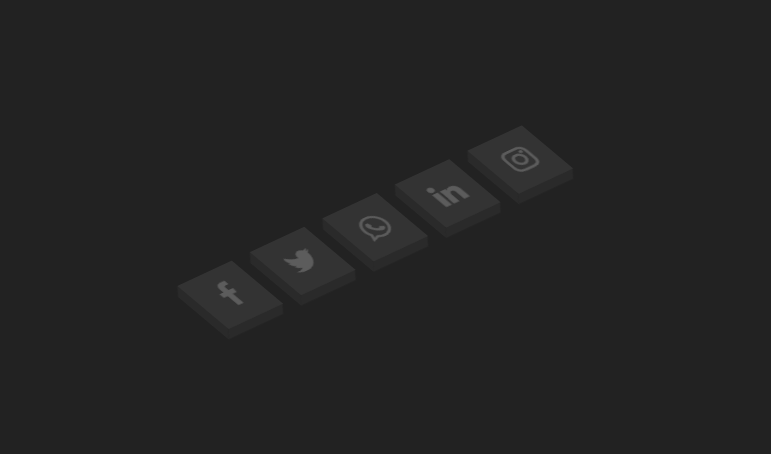

# Isometric Social Media Hover 🌐

### Isometric Social Media Hover is an interactive effect where social media icons change their appearance upon mouse hover, enhancing attractiveness and user engagement.

## ⬇Demo⬇

https://tomaszbrylski.github.io/Soicial_Media_Hover/

### Tech 🖥
- HTML
- CSS
